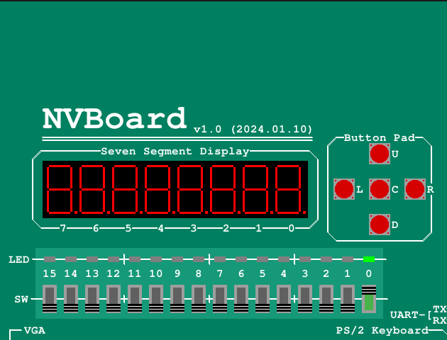
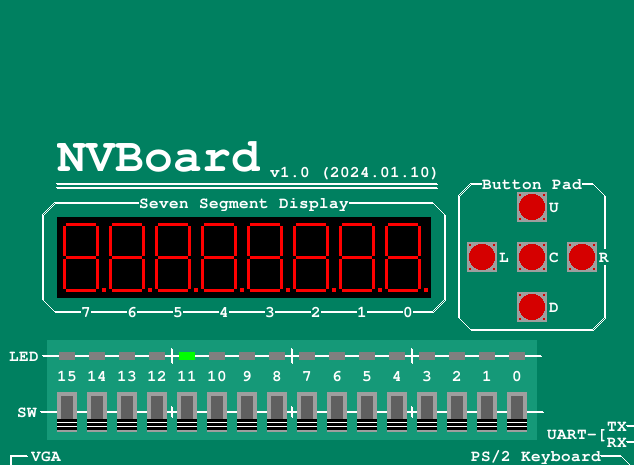

# 搭建verilator仿真环境

## 安装verilator
参考[官方文档](https://verilator.org/guide/latest/install.html#)

## C++测试样例
[官方文档](https://verilator.org/guide/latest/example_cc.html#)
- 创建Verilog和C++文件
    ```shell
    mkdir test_our
    cd test_our

    cat >our.v <<'EOF'
    module our;
        initial begin $display("Hello World"); $finish; end
    endmodule
    EOF

    cat >sim_main.cpp <<'EOF'
    #include "Vour.h"
    #include "verilated.h"
    int main(int argc, char** argv) {
        VerilatedContext* contextp = new VerilatedContext;
        contextp->commandArgs(argc, argv);
        Vour* top = new Vour{contextp};
        while (!contextp->gotFinish()) { top->eval(); }
        delete top;
        delete contextp;
        return 0;
    }
    EOF
    ```

- 运行`verilator`编译Verilog文件
    ```shell
    verilator --cc --exe --build -j 0 -Wall sim_main.cpp our.v
    ```
  - `--cc`：生成C++输出
  - `--exe`：生成可执行文件
  - `--build`：自动调用`make`进行编译
  - `-j 0`：使用所有可用的CPU核心
  - `-Wall`：显示所有警告
- 运行文件
    ```shell
    obj_dir/Vour
    ```

## 双控开关
### 仿真运行
- `top.v`
    ```verilog
    module top(
        input a,
        input b,
        output f
    );
        assign f = a ^ b;
    endmodule
    ```
- `sim_main.cpp`
    ```cpp
    #include "Vtop.h"
    #include "verilated.h"
    #include <stdio.h>
    #include <stdlib.h>
    #include <assert.h>

    int main(int argc, char** argv) {
        VerilatedContext* contextp = new VerilatedContext;
        contextp->commandArgs(argc, argv);
        Vtop* top = new Vtop{contextp};
        while (!contextp->gotFinish()) 
        { 
            int a = rand() & 1;
            int b = rand() & 1;
            top->a = a;
            top->b = b;
            top->eval();
            printf("a = %d, b = %d, f = %d\n", a, b, top->f);
            assert(top->f == (a ^ b));
        }
        delete top;
        delete contextp;
        return 0;
    }
    ```
- 编译运行
    ```shell
    verilator --cc --exe --build -j 0 -Wall top.v sim_main.cpp
    obj_dir/Vtop
    ```

### 理解RTL仿真的行为
首先在`Vtop___024root`类中实现了模块的属性及内部逻辑，而在`Vtop__Syms`中包含了各模块的实例以及仿真内部状态，最后通过包含`Vtop__Syms`实例的`Vtop`类实现供测试程序调用的接口。


## 打印并查看波形
- `sim_main.cpp`：需要包含头文件`verilated_vcd_c.h`并添加设置进行波形生成
    ```cpp
    #include "Vtop.h"
    #include "verilated.h"
    #include "verilated_vcd_c.h"
    #include <stdio.h>
    #include <stdlib.h>
    #include <assert.h>

    int main(int argc, char **argv)
    {
        VerilatedContext *contextp = new VerilatedContext;
        contextp->commandArgs(argc, argv);
        Vtop *top = new Vtop{contextp};
        Verilated::traceEverOn(true);
        VerilatedVcdC *tfp = new VerilatedVcdC; // for vcd
        top->trace(tfp, 99);                    // trace to generate
        tfp->open("wave.vcd");                  // open vcd file
        unsigned int sim_time = 100;            // to end the simulation
        while (!contextp->gotFinish() && contextp->time() < sim_time)
        {
            contextp->timeInc(1);               // Increase time
            int a = rand() & 1;
            int b = rand() & 1;
            top->a = a;
            top->b = b;
            top->eval();
            tfp->dump(contextp->time()); // generate wave
            printf("a = %d, b = %d, f = %d\n", a, b, top->f);
            assert(top->f == (a ^ b));
        }
        tfp->close(); // close vcd file
        delete top;
        delete contextp;
        return 0;
    }
    ```
- 编译运行：额外添加参数`--trace`进行波形生成
    ```shell
    verilator --cc --exe --build -j 0 -Wall --trace top.v sim_main.cpp
    obj_dir/Vtop
    ```

- 查看波形：使用`gtkwave`打开`vcd`文件
    ```shell
    gtkwave wave.vcd
    ```
    运行时报错`Failed to load module "canberra-gtk-module"`
    安装`libcanberra-gtk-module`即可解决
    ```shell
    sudo apt-get install libcanberra-gtk-module
    ```
- Debug：
    在使用`gtkwave`查看波形时，出现报错`No symbols in VCD file..is it malformed?  Exiting!`。检查代码后发现是因为没有通过`contextp->timeInc(1);`改变当前时钟周期，导致波形文件中没有时钟周期的变化。

## 编写Makefile
使用`--Mdir`重定向生成的文件夹
```Makefile
sim:
	$(call git_commit, "sim RTL") # DO NOT REMOVE THIS LINE!!!
	verilator --cc -j 0 -Wall --Mdir $(OBJ_DIR) $(BUILD_DIR)/*.v 
```
## NVBoard
### dependence
```bash
sudo apt-get install libsdl2-dev libsdl2-image-dev libsdl2-ttf-dev
```

### NVBoard实现双控开关
- `Makefile`
仿照`NVBoard`中的`Makefile`规则对`npc`的`Makefile`进行修改，将因为是否接入`NVBoard`以及是否生成波形会使用不同的参数以及仿真文件，因此添加`trace`和`board`两条新规则表示生成波形和接入`NVBoard`。
- 仿真文件
    ```cpp
    #include <nvboard.h>
    #include "Vtop.h"

    static Vtop dut;

    void nvboard_bind_all_pins(Vtop *top);

    static void single_cycle()
    {
        dut.eval();
    }

    static void reset(int n)
    {
        dut.a = 0;
        dut.b = 0;
        while (n-- > 0)
            single_cycle();
    }

    int main()
    {
        nvboard_bind_all_pins(&dut);
        nvboard_init();

        reset(10);

        while (1)
        {
            nvboard_update();
            single_cycle();
        }

        nvboard_quit();
    }
    ```
- 约束文件：将`a`映射到0号开关，`b`映射到1号开关，`f`映射到0号LED
    ```
    top=top

    # input
    a SW0
    b SW1

    # output
    f LD0
    ```
- 结果：只有在`SW0`和`SW1`不同时为1时，`LD0`才会亮
    
    

## 流水灯
### 接入NVBoard
- 约束文件：只需将输出信号映射到LED即可
    ```
    top=top

    # output
    led (LD15, LD14, LD13, LD12, LD11, LD10, LD9, LD8, LD7, LD6, LD5, LD4, LD3, LD2, LD1, LD0)
    ```
- 结果：实现从右往左的流水灯
    
    
### 理解RTL仿真的行为
在生成的C++类中，通过成员变量表示内部状态(时钟信号的表示较为复杂，需要判断上升沿下降沿)。仿真程序通过调用`API`对电路内部状态进行修改，然后调用`eval`函数根据当前状态得到下一状态(本质是一个有限状态机)。对于时序逻辑电路，既可以通过直接改变clk信号来实现时钟的上升沿和下降沿，也可以使用模块绑定的类`VerilatedContext`调用`timeInc`实现时钟的改变，
