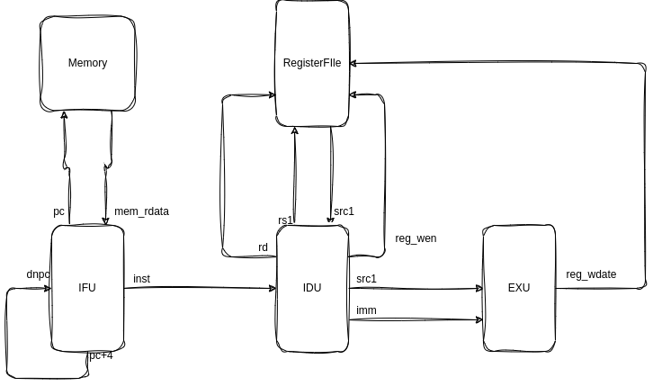

# RTL实现最简单的处理器

## 仅支持`addi`指令的单周期处理器
以下为仅支持`addi`指令的单周期处理器设计图


## DPI-C实现ebreak
使用chisel的`BlackBox`嵌入DPI-C代码，并且在仿真文件中添加对应的`ebreak`函数
```scala
class BlackBoxEbreak extends BlackBox with HasBlackBoxInline {
  val io = IO(new Bundle {
    val inst = Input(UInt(Parameters.INST_WIDTH.W))
  })
  setInline("BlackBoxEbreak.sv", s"""import "DPI-C" function void ebreak ();
    |module BlackBoxEbreak(
    |  input [${Parameters.INST_WIDTH-1}:0] inst
    |);
    |always @* begin
    |  if (inst == ${Parameters.INST_WIDTH}'h00100073) begin
    |    ebreak();
    |  end
    |end
    |endmodule
    """.stripMargin)
}
```
此外，若不添加`--split-verilog`，每次生成的verilog文件最后都会包含setInline中的文件名，使得verilator仿真报错