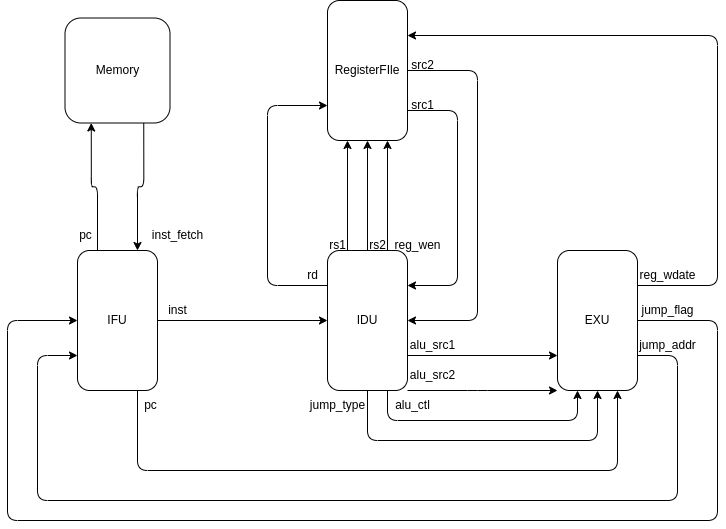
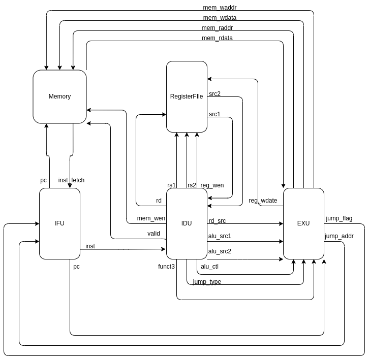

# RV32E单周期CPU
## 支持跳转指令的单周期CPU架构图


## 硬件如何区分有符号数和无符号数
```cpp
#include <stdint.h>
int32_t fun1(int32_t a, int32_t b) { return a + b; }
uint32_t fun2(uint32_t a, uint32_t b) { return a + b; }
```
编译并查看反汇编代码
```bash
riscv64-linux-gnu-gcc -c -march=rv32g -mabi=ilp32 -O2 test.c
riscv64-linux-gnu-objdump -d test.o
```
反汇编代码如下:
```asm
00000000 <fun1>:
   0:	00b50533          	add	a0,a0,a1
   4:	00008067          	ret

00000008 <fun2>:
   8:	00b50533          	add	a0,a0,a1
   c:	00008067          	ret
```
两段代码的反汇编代码是一样的，这是因为整型都是以补码形式保存的，因此无符号数与有符号数的运算操作是一致的，运算时无需区分有符号数和无符号数，只有当比较大小和算数右移时需要进行区分。

## 完整单周期CPU架构图


## ALU综合