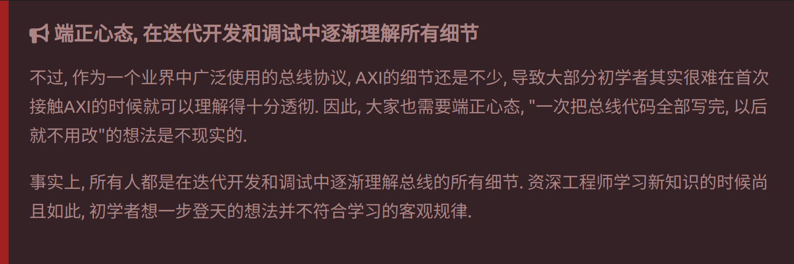
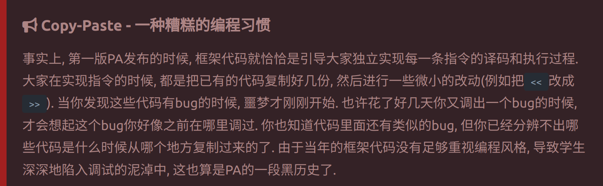
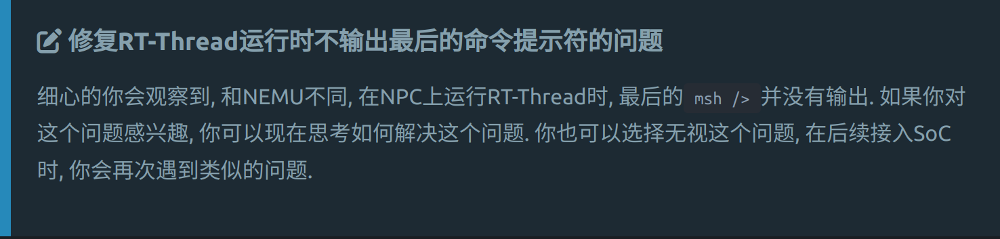

---
presentation:
  theme: beige.css
  width: 1000
  height: 800
---

<!-- slide -->
# 05.12 进度汇报
|     学号      |  姓名  |
| :-----------: | :----: |
| ysyx_23060624 | 郑圳毅 |

<!-- slide -->
## 学习进度
1. 总线
  完成总线章节的学习和相关实现，成功启动rt-thread
2. SoC
  完成至小节《最简单的SoC》，通过char-test测试

<!-- slide -->
## 遇到的问题
- 先实现，后完美
  实现总线时总想着要照顾到所有细节，导致多个状态机的时序关系难以理清。
  

<!-- slide -->
## 遇到的问题
- Copy-Paste
  编写AXI-Lite总线的AW通道时，Copy了AR通道代码进行简单的变量替换，导致出现数据循环依赖
  

<!-- slide -->
## 遇到的问题
- verilator输出缓冲区
  在NPC启动RT-Thread章节中出现的选做题并未出现相关问题，在实现总线后也未出现，直到SoC章节中出现了问题。
  
<!-- slide -->
## 谢谢

